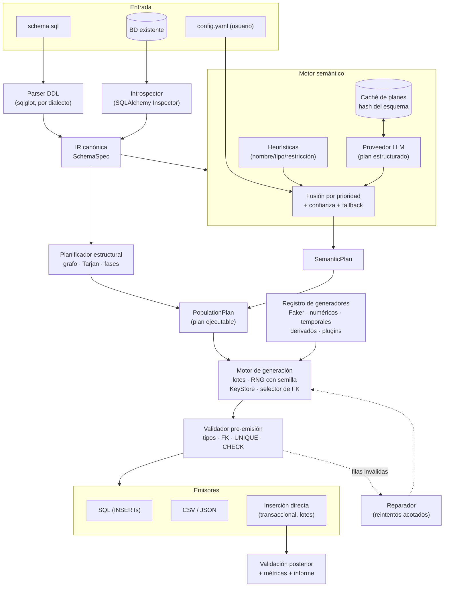

# SynthDB — Especificación técnica y estudio de viabilidad

**Generador local-first de datos sintéticos semánticamente coherentes para bases de datos relacionales**

*Versión 0.1 del documento · 15 de julio de 2026 · Nombre del proyecto provisional (`synthdb`)*

---

## 1. Veredicto ejecutivo

**El proyecto es viable**, y además el momento es bueno: todas las piezas difíciles ya existen como componentes maduros de código abierto (parser SQL multi-dialecto con AST, salidas estructuradas en modelos locales, Faker, SQLAlchemy). Lo que no existe es un proyecto que las integre bien con la división de responsabilidades correcta, que es exactamente la que propones en tu principio central.

**Estoy de acuerdo con el principio central, con un matiz.** El LLM debe actuar como *compilador semántico*: recibe el esquema una sola vez y produce un plan estructurado y validable (clasificación de columnas, generadores propuestos, correlaciones, reglas probables). La generación masiva, la selección de claves foráneas, el cumplimiento de restricciones y la validación son código determinista. El matiz: además del plan, conviene permitir que el LLM produzca **vocabularios acotados** (por ejemplo, 40 nombres plausibles de piezas de automóvil, 30 conceptos de factura de cementerio) que después el motor determinista muestrea con semilla. Esto da riqueza de dominio sin pagar el coste ni la fragilidad de "una llamada por fila", y mantiene la reproducibilidad porque los vocabularios se cachean junto al plan. La única excepción legítima a "nunca filas con LLM" son columnas de texto libre largo (descripciones, observaciones) en volúmenes pequeños y siempre como opción explícita del usuario.

**Qué es relativamente sencillo** (ingeniería conocida, riesgo bajo):

- Parsear DDL a una representación canónica con `sqlglot` (parser AST puro Python, sin dependencias, con más de 30 dialectos).
- Grafo de dependencias, orden topológico, detección de ciclos con Tarjan.
- Generación por lotes reproducible con Faker + generadores propios + semillas jerárquicas.
- Almacenes de claves primarias y selección de claves foráneas con distribuciones controladas.
- Emisores SQL/CSV/JSON e inserción transaccional con SQLAlchemy.

**Cuál es el principal problema técnico**: la *fiabilidad de la inferencia semántica* y, sobre todo, la **coherencia entre columnas de una misma fila y entre filas relacionadas** (precio ≈ f(superficie, tipo); fecha de fallecimiento > fecha de nacimiento; suma de pagos ≈ precio del contrato). El SQL casi nunca codifica estas reglas: hay que inferirlas (con incertidumbre), permitir declararlas (YAML) y ejecutarlas con un mini-lenguaje de expresiones seguro. El segundo riesgo es aceptar que un modelo local de 7–8B se equivocará en parte del plan: todo el diseño de confianza, fallback, caché y revisión humana del plan existe para contener ese error antes de que se multiplique por miles de filas.

**Riesgo que hay que asumir explícitamente**: el sistema nunca "comprenderá" cualquier base de datos solo mirando su SQL. Con nombres opacos y sin comentarios, ningún componente (ni humano) puede hacerlo. El diseño correcto no promete comprensión universal: promete *degradación controlada* — datos siempre válidos estructuralmente, semántica proporcional a la información disponible, y avisos claros de dónde falta información.

---

## 2. Alcance realista

### MVP (lo mínimo que demuestra la tesis del proyecto)

- Entrada: un archivo `schema.sql` en **un solo dialecto de referencia: PostgreSQL** (sqlglot permite leer otros, pero solo se promete PostgreSQL).
- IR canónica completa: tablas, columnas, tipos normalizados, PK simples y compuestas, FK, `NOT NULL`, `UNIQUE`, `CHECK` (subconjunto), `DEFAULT`, enums (tipo `ENUM` y `CHECK ... IN`), comentarios.
- Grafo de dependencias + orden topológico. Ciclos soportados solo en dos formas: **autorreferencia** (`manager_id`) y **ciclo rompible por FK anulable**. Cualquier otro ciclo se reporta y detiene con diagnóstico claro.
- Motor semántico: heurísticas por nombre/tipo/restricción + Faker (con locale) + plan LLM opcional vía Ollama con salida estructurada. **El sistema funciona con `--no-llm`** usando solo heurísticas.
- Reglas entre columnas mediante un mini-DSL seguro (`fecha_fin >= fecha_inicio`, `precio = superficie_m2 * ref('precio_m2') * noise(0.15)`).
- Semillas y reproducibilidad total. Generación en memoria hasta ~10⁶ filas totales.
- Salidas: archivo SQL de `INSERT`s, CSV por tabla, y `--dry-run` (plan + muestra de 10 filas por tabla, sin escribir nada).
- Validación previa a la emisión (tipos, FK, unicidad, CHECKs soportados) + informe.
- Configuración YAML con prioridad absoluta sobre inferencias.
- Caché del plan semántico por hash del esquema.

### Primera versión estable (v1.0)

- Dialectos MySQL/MariaDB y SQLite además de PostgreSQL.
- Introspección de bases de datos existentes vía SQLAlchemy (`Inspector`), con la misma IR como destino.
- Inserción directa transaccional por lotes, con cuarentena de filas fallidas y reintentos limitados.
- Ciclos generales: rotura por FK diferible (PostgreSQL `DEFERRABLE`) o por fase `INSERT`-con-`NULL` + `UPDATE`.
- Reparación selectiva de filas inválidas (regenerar solo columnas ofensoras).
- Intérprete de `CHECK` ampliado + *rejection sampling* acotado para CHECKs no interpretables.
- Volúmenes grandes: almacén de claves con *spill* a SQLite/disco, generación por streaming a archivo.
- Adaptadores LLM: Ollama, cualquier endpoint compatible OpenAI (cubre vLLM y llama.cpp server), Anthropic.
- Sistema de plugins de generadores (entry points de Python).
- Métricas de calidad semántica y comando `validate` contra la BD poblada.

### Funcionalidades avanzadas (post-1.0, si el proyecto tracciona)

- Muestreo estadístico opt-in de una BD real (solo agregados/distribuciones, nunca valores en claro por defecto) para calibrar distribuciones.
- Correlaciones multivariantes (cópulas; integración opcional con SDV como *backend* de columnas numéricas correladas).
- Generación incremental sobre una BD ya poblada (añadir N filas coherentes con lo existente).
- Escenarios temporales ("simula 2 años de actividad") con procesos de llegada.
- LLM-as-judge opcional para evaluar plausibilidad de muestras.
- Interfaz web de revisión/edición del plan.

### Objetivos que NO deberían prometerse

- Compatibilidad perfecta con cualquier dialecto SQL (triggers, procedimientos, dominios exóticos, columnas generadas con funciones arbitrarias).
- Interpretación de **cualquier** expresión `CHECK` (son SQL arbitrario; se soporta un subconjunto declarado y el resto se valida en la BD).
- Comprensión semántica de esquemas con nombres opacos sin metadatos adicionales.
- Realismo estadístico equivalente a datos reales (eso es el terreno de SDV/Gretel con datos de entrenamiento reales; este proyecto genera datos *plausibles y coherentes*, no *estadísticamente fieles*).
- Respeto de reglas de negocio implementadas en triggers o código de aplicación: la BD podrá rechazarlas y el sistema lo reportará, pero no puede anticiparlas.

---

## 3. Arquitectura propuesta

Monolito modular en un solo proceso Python. No hay ninguna necesidad demostrable de colas, microservicios ni infraestructura distribuida: el cuello de botella real es una llamada LLM (una vez por esquema, cacheada) y la E/S de la base de datos (resuelta con lotes).



### Responsabilidades de cada componente

**Parser DDL.** Convierte `schema.sql` en la IR usando el AST de sqlglot con el dialecto declarado. Extrae todo lo estructural. No interpreta significado. Conserva los AST de las expresiones `CHECK` y `DEFAULT` (además de su texto) para el intérprete de restricciones.

**Introspector.** Ruta alternativa de entrada: lee catálogo de una BD viva con SQLAlchemy y produce la misma IR. Los comentarios de tabla/columna se recuperan cuando el motor los expone.

**IR canónica (`SchemaSpec`).** Única fuente de verdad estructural para todo lo demás. Serializable a JSON; su hash canónico gobierna la caché.

**Planificador estructural.** Construye el grafo de dependencias, calcula componentes fuertemente conexos, decide estrategias para ciclos/autorreferencias/tablas puente y emite las **fases** ordenadas del `PopulationPlan`.

**Motor semántico.** Tres fuentes (heurísticas, LLM, configuración de usuario) fusionadas con prioridades explícitas y puntuación de confianza. Salida: `SemanticPlan` (qué genera cada columna y con qué reglas). Nunca puede contradecir una restricción de la IR: la IR gana siempre.

**Registro de generadores.** Catálogo tipado de generadores: proveedores Faker parametrizados, rangos numéricos con distribución, rangos temporales, plantillas, secuencias, UUID, elección ponderada, derivados (mini-DSL) y plugins del usuario.

**Motor de generación.** Ejecuta el plan por fases y lotes: RNG derivado de semillas, resolución del orden de columnas intra-fila, selección de FKs desde el `KeyStore`, aplicación de reglas derivadas.

**Validadores.** Pre-emisión (barato, en memoria, por lote) y posterior (contra la BD, que es el juez final). Producen informe y métricas.

**Reparador.** Regenera únicamente las columnas ofensoras de las filas rechazadas, con un máximo de reintentos; lo irreparable va a cuarentena con diagnóstico.

**Emisores.** SQL, CSV/JSON, inserción directa, dry-run. Todos consumen el mismo flujo de filas validadas.

---

## 4. Flujo completo

Recorrido de `synthdb populate schema.sql -c config.yaml --target postgres://...`:

1. **Carga y parseo.** Se lee `schema.sql`, se parsea con el dialecto configurado (o autodetectado con aviso). Errores de sintaxis se reportan con línea y columna y detienen el proceso.
2. **Normalización a IR.** Se construye `SchemaSpec`: tipos normalizados a un catálogo canónico (`integer`, `numeric(p,s)`, `text`, `varchar(n)`, `date`, `timestamp`, `boolean`, `uuid`, `enum[...]`, `json`, `bytea`...), restricciones, comentarios. Se calcula el hash canónico del esquema.
3. **Análisis estructural.** Grafo de dependencias → SCCs → estrategias de ciclo → orden de fases. Se detectan tablas puente y cardinalidades implícitas (`UNIQUE` sobre FK ⇒ 1:1). Si hay un ciclo irrompible, se detiene aquí con diagnóstico y sugerencias (antes de gastar tokens o tiempo).
4. **Análisis semántico.** (a) Heurísticas etiquetan cada columna con un rol semántico candidato y confianza. (b) Si el LLM está habilitado y no hay plan cacheado para ese hash+modelo+versión-de-prompt, se envía **solo el esquema y metadatos** (nunca datos) troceado por vecindarios de tablas, exigiendo salida conforme al JSON Schema del contrato (§8). (c) Se valida la respuesta con Pydantic; lo inválido se descarta con reintento acotado. (d) Fusión: configuración de usuario > restricciones de la IR > LLM/heurísticas por confianza > fallback seguro. Resultado: `SemanticPlan`.
5. **Compilación del plan ejecutable.** `SemanticPlan` + fases estructurales + cantidades del YAML → `PopulationPlan`: para cada tabla, generadores concretos ya resueltos, orden de columnas intra-fila (grafo de dependencias de columnas), estrategia de FK, semilla derivada, tamaño de lote.
6. **Revisión (opcional pero recomendada).** `synthdb plan` imprime el plan legible con confianzas y avisos. En modo interactivo o CI, el usuario puede exigir `--min-confidence` para abortar si algo queda por debajo.
7. **Lote piloto.** Antes del volumen completo se generan y validan ~100 filas por tabla (y, si el destino es una BD, se insertan dentro de una transacción que se revierte, o contra un SQLite efímero construido desde la IR). Si el piloto falla, se aborta con el error concreto — esto es lo que impide fabricar miles de filas inválidas.
8. **Generación por fases y lotes.** Para cada fase, en orden: se generan lotes (p. ej. 5 000 filas), se validan en memoria, las PK entran en el `KeyStore`, y el lote se emite (archivo o `INSERT` transaccional). Las fases `UPDATE` (ciclos/autorreferencias) se ejecutan tras las inserciones correspondientes.
9. **Reparación.** Filas rechazadas → regeneración selectiva de columnas ofensoras (máx. N intentos) → cuarentena si persisten.
10. **Validación posterior e informe.** Conteos, huérfanos (consultas anti-join), CHECKs delegados a la BD, métricas semánticas (§13). Se escribe `report.json` + resumen en consola con semilla, hash del esquema y versión del plan para reproducir el resultado exactamente.

---

## 5. Representación intermedia

Entidades principales (Pydantic v2; se muestran los campos esenciales):

- **`SchemaSpec`**: `dialect`, `tables: list[TableSpec]`, `hash` (derivado), `warnings`.
- **`TableSpec`**: `name`, `schema` (namespace), `columns`, `primary_key: list[str]` (vacía si no hay PK), `foreign_keys: list[RelationshipSpec]`, `uniques: list[list[str]]`, `checks: list[CheckSpec]`, `comment`, `kind` (`regular | bridge | lookup`, inferido).
- **`ColumnSpec`**: `name`, `type: TypeSpec` (kind canónico + parámetros), `nullable`, `default: DefaultSpec | None`, `enum_values: list | None`, `generated: bool`, `comment`, `checks` (los que solo afectan a esta columna, ya propagados como cotas cuando es posible).
- **`RelationshipSpec`**: `columns`, `ref_table`, `ref_columns`, `on_delete/on_update`, `deferrable`, `nullable` (derivado), `cardinality_hint` (`many_to_one | one_to_one | self_reference`, derivado).
- **`CheckSpec`**: `sql_text`, `ast_supported: bool`, `bounds_derived: dict | None` (cotas propagadas), `columns_involved`.
- **`GeneratorSpec`**: `type` (id del registro: `faker`, `numeric_range`, `datetime_range`, `choice`, `template`, `sequence`, `uuid`, `derived`, `text_pool`...), `params`, `null_ratio`, `unique: bool`.
- **`SemanticPlan`**: por tabla → `entity` (etiqueta inferida), `row_estimate_hint`; por columna → `semantic_role`, `generator: GeneratorSpec`, `depends_on: list[str]`, `rules: list[RuleSpec]` (mini-DSL), `distribution`, `confidence: float`, `source` (`user | ir | llm | heuristic | fallback`), `warnings`.
- **`PopulationPlan`**: `seed`, `phases: list[Phase]` donde `Phase` es `Insert(tables, row_counts, fk_strategies)` o `Update(table, columns)` o `Deferred(tables)`; por tabla, generadores resueltos y orden de columnas.

Ejemplo reducido (tabla `viviendas` tras parseo + plan semántico):

```json
{
  "table": {
    "name": "viviendas",
    "primary_key": ["id"],
    "columns": [
      {"name": "id", "type": {"kind": "integer", "autoincrement": true}, "nullable": false},
      {"name": "tipo", "type": {"kind": "text"}, "nullable": false,
       "enum_values": ["piso", "chalet", "adosado"]},
      {"name": "superficie_m2", "type": {"kind": "numeric", "precision": 7, "scale": 2},
       "nullable": false,
       "checks": [{"sql_text": "superficie_m2 > 0", "ast_supported": true,
                    "bounds_derived": {"min_exclusive": 0}}]},
      {"name": "anio_construccion", "type": {"kind": "integer"}, "nullable": false,
       "checks": [{"sql_text": "anio_construccion BETWEEN 1900 AND 2026",
                    "ast_supported": true,
                    "bounds_derived": {"min": 1900, "max": 2026}}]},
      {"name": "propietario_id", "type": {"kind": "integer"}, "nullable": false}
    ],
    "foreign_keys": [
      {"columns": ["propietario_id"], "ref_table": "clientes", "ref_columns": ["id"],
       "cardinality_hint": "many_to_one", "nullable": false, "deferrable": false}
    ]
  },
  "semantic_plan": {
    "entity": "vivienda en venta/alquiler",
    "columns": {
      "tipo": {"semantic_role": "categoria_inmueble",
               "generator": {"type": "choice",
                              "params": {"values": ["piso", "chalet", "adosado"],
                                         "weights": [0.62, 0.18, 0.20]}},
               "confidence": 0.97, "source": "ir"},
      "superficie_m2": {"semantic_role": "superficie",
               "generator": {"type": "numeric_range",
                              "params": {"min": 35, "max": 450,
                                         "distribution": {"family": "lognormal",
                                                           "params": {"median": 90, "sigma": 0.45}},
                                         "round_to": 1}},
               "depends_on": ["tipo"], "confidence": 0.86, "source": "llm"},
      "propietario_id": {"semantic_role": "fk",
               "generator": {"type": "fk", "params": {"strategy": "zipf", "s": 1.2}},
               "confidence": 1.0, "source": "ir",
               "warnings": ["cardinalidad no declarada; se asume N propietarios → M viviendas"]}
    }
  }
}
```

Obsérvese la trazabilidad: cada decisión lleva `source` y `confidence`, y las restricciones duras (`enum_values`, cotas de `CHECK`) proceden de la IR y son inamovibles para el LLM.

---

## 6. Algoritmo de planificación

### 6.1 Construcción del grafo y ordenación

Nodos = tablas. Arista `hijo → padre` por cada FK (el hijo *depende* del padre). Las autorreferencias se anotan aparte y no crean arista (se resuelven dentro de la propia tabla).

```python
def plan_structure(schema: SchemaSpec) -> list[Phase]:
    g = DiGraph()
    for t in schema.tables:
        g.add_node(t.name)
    for t in schema.tables:
        for fk in t.foreign_keys:
            if fk.ref_table != t.name:
                g.add_edge(t.name, fk.ref_table)   # t depende de ref_table

    sccs = tarjan_scc(g)                  # componentes fuertemente conexos
    dag  = condense(g, sccs)              # DAG de componentes
    order = topo_sort(dag)                # de dependencias hacia dependientes

    phases = []
    for comp in order:                    # comp = conjunto de tablas
        if len(comp) == 1:
            t = comp[0]
            if has_self_reference(t):
                phases += plan_self_reference(t)
            else:
                phases.append(Insert([t]))
        else:
            phases += plan_cycle(comp)    # ciclo real entre >= 2 tablas
    return merge_compatible_phases(phases)  # tablas independientes → misma fase
```

El orden topológico responde directamente a "¿cómo se transforma el esquema en un plan ejecutable?": las fases resultantes son la columna vertebral del `PopulationPlan`; sobre ellas se cuelgan cantidades, generadores y estrategias de FK.

### 6.2 Ciclos entre tablas

Estrategias en orden de preferencia, elegidas automáticamente e informadas en el plan:

```python
def plan_cycle(tables) -> list[Phase]:
    edges = fk_edges_within(tables)

    # 1) Romper por FK anulable: insertar con NULL y actualizar después
    e = first(edges, key=lambda e: e.nullable)
    if e:
        inner_order = topo_sort(remove_edge(tables, e))
        return [Insert(inner_order, null_fks=[e]),
                Update(e.child_table, columns=e.columns)]   # asigna FKs reales

    # 2) FK diferible (PostgreSQL DEFERRABLE INITIALLY DEFERRED):
    #    insertar todo el ciclo en una transacción con constraints diferidas
    e = first(edges, key=lambda e: e.deferrable)
    if e:
        return [Deferred(tables)]

    # 3) Irrompible con garantías → detener con diagnóstico
    raise UnbreakableCycle(
        tables,
        hint="Opciones: marcar una FK como anulable/diferible, "
             "o autorizar --allow-ddl para desactivar y reactivar la constraint "
             "(desaconsejado; nunca por defecto)."
    )
```

Nota sobre la fase `Update`: los valores de la FK se eligen igualmente con el `KeyStore` y la misma semilla, de modo que el resultado es reproducible aunque llegue en dos pasos. Cuando la salida es un **archivo SQL**, la fase `Update` se emite como sentencias `UPDATE` tras los `INSERT`, o el ciclo entero se emite dentro de `BEGIN; SET CONSTRAINTS ALL DEFERRED; ...; COMMIT;` si la FK es diferible.

### 6.3 Autorreferencias (`manager_id`)

Se generan **por niveles**, lo que además produce jerarquías realistas:

```python
def plan_self_reference(t) -> list[Phase]:
    fk = self_fk(t)
    if fk.nullable:
        # Niveles: L0 (raíces, manager_id=NULL), L1 apunta a L0, etc.
        return [InsertLeveled(t, levels=level_sizes(t.row_count, branching=5))]
    if fk.deferrable:
        return [Deferred([t])]
    # NOT NULL y no diferible: única salida válida sin DDL es que las raíces
    # se referencien a sí mismas (si ninguna CHECK lo prohíbe); se avisa.
    return [InsertLeveled(t, roots_point_to_self=True, warn=True)]
```

`level_sizes` reparte N filas en una geometría de árbol configurable (`hierarchy.branching`, `hierarchy.max_depth` en YAML). Cada nivel solo elige `manager_id` entre claves de niveles anteriores, garantizando aciclicidad de los *datos* (una CHECK como `manager_id <> id` también se respeta).

### 6.4 Tablas puente (muchos a muchos)

Detección: tabla cuya PK (o un `UNIQUE`) está formada íntegramente por columnas que son FKs hacia ≥ 2 tablas, con pocas columnas adicionales. Marcada `kind = bridge`.

Generación: en lugar de elegir cada FK de forma independiente (colisionaría con la unicidad del par), se **muestrean pares sin reemplazo**:

```python
def generate_bridge(t, n, rng, keystore):
    a_keys = keystore[t.fk_a.ref_table]
    b_keys = keystore[t.fk_b.ref_table]
    n = min(n, len(a_keys) * len(b_keys))          # techo combinatorio, con aviso
    for idx in sample_pairs_without_replacement(len(a_keys), len(b_keys), n, rng):
        yield row(a_keys[idx.a], b_keys[idx.b], extra_columns(rng))
```

`sample_pairs_without_replacement` usa muestreo de índices sobre el producto cartesiano (uniforme) o un esquema por cuotas si el usuario configura cardinalidades ("cada reparación usa entre 1 y 8 piezas"), que es el modo más útil en la práctica.

### 6.5 Claves compuestas, tablas sin PK y casos restantes

- **PK compuesta**: el `KeyStore` almacena tuplas; la unicidad se comprueba sobre la tupla completa. Una FK compuesta selecciona la tupla entera del padre (nunca columnas por separado, que fabricaría combinaciones inexistentes).
- **Tablas sin PK**: se generan igualmente; no aportan claves al `KeyStore` (nadie puede referenciarlas con FK estándar); los `UNIQUE` que existan se respetan; se permiten duplicados exactos salvo que el usuario lo prohíba.
- **FK no anulable**: obliga a que el padre esté en una fase anterior (garantizado por el grafo) y a `null_ratio = 0` en el selector.
- **Columnas generadas (`GENERATED ALWAYS AS`)**: se excluyen de la generación y de los `INSERT`; la BD las calcula. En salida CSV se calculan con el intérprete de expresiones si la expresión está soportada; si no, se omiten con aviso.
- **Restricciones diferibles**: además de servir para ciclos, se registran para que el emisor SQL agrupe correctamente las transacciones.

### 6.6 Generación e inserción por fases

```python
def execute(plan: PopulationPlan, sink: Sink):
    run_pilot(plan, sink)                        # ~100 filas/tabla, transacción revertida
    for phase in plan.phases:
        for table in phase.tables:
            rng = rng_for(plan.seed, table.name) # semilla derivada por tabla
            for batch in batches(table.row_count, size=5000):
                rows = generate_batch(table, batch, rng, keystore)
                ok, bad = prevalidate(rows, table)
                ok += repair(bad, table, rng, max_retries=3)  # lo irreparable → cuarentena
                keystore.add(table, primary_keys_of(ok))
                sink.write(table, ok, phase)     # archivo o transacción por lote
        sink.flush_phase(phase)                  # UPDATEs de ciclos, COMMIT diferidos
```

---

## 7. Motor semántico

### 7.1 Fuentes y orden de prioridad

Cuando dos fuentes se contradicen gana la de mayor prioridad, sin excepciones y dejando rastro en el plan (`source`):

1. **Configuración del usuario (YAML).** Manda siempre. Si contradice una restricción de la BD (p. ej. fija un valor fuera de un CHECK), se rechaza en la compilación del plan con error explícito: ni siquiera el usuario puede pedir datos que la BD rechazará.
2. **Restricciones de la IR (la BD como fuente de verdad).** Enums, cotas de CHECK, `NOT NULL`, unicidad, tipos. Recortan cualquier propuesta: si el LLM sugiere `uniform(0, 10^9)` para una columna con `CHECK (x BETWEEN 1900 AND 2026)`, las cotas se intersecan y prevalece el CHECK.
3. **Plan del LLM**, si su confianza supera el umbral (por defecto 0,7; configurable).[^adr-002]
4. **Heurísticas deterministas.** Diccionario de patrones nombre→rol (multiidioma es/en: `email`, `correo`, `phone|tel(efono)?`, `fecha_|_date|_at$`, `precio|price|importe|amount`, `nombre|name`, `apellidos?|surname|last_name`, `dni|nif|ssn|vat`, `iban`, `direccion|address`, `codigo_postal|zip`, `lat|lon(gitud)?`, `url`, `%_id$`…) combinados con tipo y restricciones (un `varchar(2)` llamado `pais` → ISO-3166 alfa-2). Son rápidas, testeables y funcionan sin LLM.
5. **Fallback seguro por tipo.** Siempre existe: enteros en rango pequeño, texto tipo `"{tabla}_{columna}_{n}"`, fechas en la última década, booleanos 50/50. Garantiza validez estructural aunque la semántica sea pobre, y se marca con aviso en el informe.

Respuesta directa a "¿cómo se asigna un generador a cada columna?": cada fuente propone `(GeneratorSpec, confianza)`; el fusor recorre la lista de prioridad, aplica el recorte de la IR, y el primero que supera el umbral gana. Todo queda auditado en el plan.

[^adr-002]: El experimento del Hito 0 encontró que la confianza autodeclarada por el modelo no está calibrada ante falta de evidencia (0% de calibración correcta sobre columnas opacas). Ver ADR-002 para el detalle y la enmienda al umbral.

### 7.2 Dependencias entre columnas de una misma fila

El `SemanticPlan` declara `depends_on` y `rules` por columna. En compilación se construye un **grafo de columnas por tabla** y se ordena topológicamente (un ciclo entre columnas es error de plan). En ejecución, cada generador recibe un `RowContext`:

```python
ctx.row["fecha_inicio"]          # valores ya generados de la fila
ctx.parent("vivienda_id")        # fila padre elegida por la FK (dict de columnas)
ctx.rng                          # RNG determinista de la fila
```

Esto resuelve los tres patrones necesarios: derivación (`total = cantidad * precio_unitario`), restricción temporal (`fecha_defuncion > fecha_nacimiento`: el generador de la segunda usa la primera como cota inferior) y coherencia con el padre (`compraventa.fecha >= parent(vivienda_id).anio_construccion`).

Las `rules` se expresan en un **mini-DSL de expresiones** (comparaciones, aritmética, `and/or/not`, funciones blancas: `date_add`, `years_between`, `noise(σ)`, `round`, `parent()`, `ref()` para constantes con nombre). Se parsea a AST propio y se evalúa con un intérprete seguro — nunca `eval` de Python ni SQL ejecutado. Cada regla se usa dos veces: como *cota del generador* cuando es una desigualdad simple, y como *aserción de validación* en todos los casos.

### 7.3 Distribuciones sin pedir filas al modelo

El LLM (o el usuario) declara la **familia y parámetros**; un muestreador determinista (`random`/NumPy con el RNG sembrado) produce los valores: `uniform`, `normal`, `lognormal` (precios, superficies), `zipf` (popularidad), `categorical` con pesos, `poisson` (conteos), y rangos temporales con estacionalidad simple opcional. Para texto con sabor de dominio, el generador `text_pool` consume un vocabulario producido una vez por el LLM y cacheado (matiz del principio central, §1). Coste: O(1) llamadas por esquema, no por fila.

### 7.4 KeyStore y selección de claves foráneas

- **Almacenamiento**: por tabla, un array *append-only* de PKs (o tuplas). En memoria hasta ~10⁷ claves sin problema; por encima, *spill* transparente a SQLite en disco con muestreo por índice aleatorio (v1.0).
- **Selección** (responde a cardinalidades razonables):
  - `uniform`: cualquier padre con igual probabilidad (por defecto).
  - `zipf(s)`: pocos padres concentran muchos hijos (clientes recurrentes, agentes estrella) — el defecto *recomendado* por el plan cuando el rol semántico lo sugiere.
  - `unique_subset`: relaciones 1:1 detectadas (`UNIQUE` sobre la FK) o declaradas; muestrea padres sin reemplazo.
  - `quota(min, max)`: cada padre recibe entre `min` y `max` hijos; útil en puentes y en "cada contrato tiene 1–12 pagos".
  - `null_ratio`: proporción de NULL en FKs anulables.
- Con PK compuesta se muestrea el índice de la tupla, nunca componentes sueltos.

### 7.5 CHECKs complejos

Pipeline en tres niveles: (1) **interpretables** (comparaciones, `BETWEEN`, `IN`, `LIKE` de prefijo/sufijo, aritmética y booleanas sobre columnas de la fila) → se *propagan como cotas* al generador y se validan; (2) **no interpretables pero evaluables fila a fila** trasladándolos al mini-DSL manualmente vía YAML; (3) **opacos** (subconsultas, funciones definidas por el usuario) → no se intentan: se genera, se valida contra la BD, y si la tasa de rechazo del lote piloto supera un umbral (p. ej. 20 %), se aborta pidiendo al usuario una regla YAML. El *rejection sampling* solo se usa acotado (máx. K intentos por fila) y nunca como estrategia principal.

### 7.6 Contención de errores del modelo (evitar miles de filas inválidas)

Cinco barreras encadenadas, todas ya presentes en el flujo: salida estructurada validada con Pydantic (lo malformado no entra); recorte por la IR (lo inválido estructuralmente no sobrevive); umbral de confianza con fallback (lo dudoso degrada a seguro con aviso); lote piloto validado, e insertado en transacción revertida cuando hay BD (lo incoherente explota con 100 filas, no con 10⁶); y validación por lote + reparación selectiva durante la ejecución. La revisión humana con `synthdb plan` es la sexta barrera, opcional.

---

## 8. Contrato con el modelo de lenguaje

El modelo recibe: IR serializada del vecindario de tablas (tabla objetivo + resumen de sus padres directos), comentarios, y la lista cerrada de tipos de generador disponibles. Devuelve **exclusivamente** JSON conforme a este esquema (impuesto por decodificación restringida cuando el backend lo permite, y validado siempre con Pydantic al recibirlo). El modelo **no puede** emitir SQL, código, ni nombres de generador fuera del catálogo; el campo `expression` del mini-DSL se parsea con el intérprete seguro y se descarta (con aviso) si no compila.

```json
{
  "$schema": "https://json-schema.org/draft/2020-12/schema",
  "title": "SemanticPlanResponse",
  "type": "object",
  "required": ["tables"],
  "additionalProperties": false,
  "properties": {
    "tables": {
      "type": "array",
      "items": {
        "type": "object",
        "required": ["table_name", "entity", "confidence", "columns"],
        "additionalProperties": false,
        "properties": {
          "table_name": {"type": "string"},
          "entity": {"type": "string",
                     "description": "Qué representa la tabla, en 3-8 palabras"},
          "confidence": {"type": "number", "minimum": 0, "maximum": 1},
          "warnings": {"type": "array", "items": {"type": "string"}},
          "columns": {
            "type": "array",
            "items": {
              "type": "object",
              "required": ["column_name", "semantic_role", "generator", "confidence"],
              "additionalProperties": false,
              "properties": {
                "column_name": {"type": "string"},
                "semantic_role": {"type": "string",
                  "description": "Etiqueta corta: email, nombre_persona, precio, superficie..."},
                "generator": {
                  "type": "object",
                  "required": ["type"],
                  "additionalProperties": false,
                  "properties": {
                    "type": {"enum": ["faker", "choice", "numeric_range",
                              "datetime_range", "template", "sequence",
                              "uuid", "derived", "text_pool"]},
                    "params": {"type": "object"}
                  }
                },
                "depends_on": {"type": "array", "items": {"type": "string"},
                  "description": "Columnas de la misma fila de las que depende"},
                "rules": {
                  "type": "array",
                  "items": {
                    "type": "object",
                    "required": ["kind", "expression"],
                    "properties": {
                      "kind": {"enum": ["temporal", "derivation", "consistency"]},
                      "expression": {"type": "string",
                        "description": "Mini-DSL, p. ej. 'fecha >= parent(vivienda_id).anio_construccion'"},
                      "rationale": {"type": "string"}
                    }
                  }
                },
                "distribution": {
                  "type": "object",
                  "properties": {
                    "family": {"enum": ["uniform", "normal", "lognormal",
                               "zipf", "categorical", "poisson"]},
                    "params": {"type": "object"}
                  }
                },
                "null_ratio": {"type": "number", "minimum": 0, "maximum": 1},
                "confidence": {"type": "number", "minimum": 0, "maximum": 1},
                "warnings": {"type": "array", "items": {"type": "string"}}
              }
            }
          },
          "fk_hints": {
            "type": "array",
            "items": {
              "type": "object",
              "required": ["fk_columns", "strategy"],
              "properties": {
                "fk_columns": {"type": "array", "items": {"type": "string"}},
                "strategy": {"enum": ["uniform", "zipf", "unique_subset", "quota"]},
                "params": {"type": "object"},
                "confidence": {"type": "number", "minimum": 0, "maximum": 1}
              }
            }
          }
        }
      }
    }
  }
}
```

Decisiones deliberadas: `additionalProperties: false` en todos los niveles (los modelos pequeños inventan campos); las FKs **no** llevan generador asignable por el LLM — su existencia y validez es estructural, el modelo solo aporta `fk_hints` de cardinalidad; `warnings` da al modelo una vía legítima para expresar duda en lugar de inventar (reduce alucinación de forma medible); y la confianza es por columna, no global, para que la degradación a fallback sea quirúrgica.

---

## 9. Modelos locales y APIs

### 9.1 Interfaz común

```python
class LLMProvider(Protocol):
    def analyze(self, prompt: str, response_schema: dict,
                *, temperature: float = 0.0, max_tokens: int, seed: int | None) -> dict:
        """Devuelve JSON validado contra response_schema o lanza ProviderError."""

    @property
    def fingerprint(self) -> str:
        """provider:model:version — participa en la clave de caché."""
```

Implementaciones del MVP/v1.0: `OllamaProvider` (endpoint nativo con `format` = JSON Schema), `OpenAICompatProvider` (un solo adaptador cubre vLLM, llama.cpp server, LM Studio, OpenAI, y muchos gateways, vía `response_format`/salidas guiadas del endpoint compatible) y `AnthropicProvider`. El núcleo solo conoce el `Protocol`; añadir un backend es un archivo.

### 9.2 Comparativa

| Criterio | Ollama (local, 7–8B cuantizado) | vLLM / llama.cpp server (local, servidor dedicado) | API externa (Anthropic / OpenAI) |
|---|---|---|---|
| Privacidad | Máxima: el esquema no sale de la máquina | Máxima (misma red) | El esquema (no los datos) sale a un tercero; puede ser inaceptable en entornos regulados |
| Instalación | Trivial (`ollama pull`) | Requiere configurar servidor; vLLM pide GPU | Solo una clave de API |
| Hardware | Un portátil moderno con ~8–16 GB de RAM/VRAM ejecuta modelos 7–8B cuantizados de forma usable | vLLM: GPU dedicada; llama.cpp: flexible CPU/GPU | Ninguno |
| Salida estructurada | Sí: `format` acepta JSON Schema | Sí: decodificación guiada por esquema/gramática (vLLM guided decoding, GBNF en llama.cpp) | Sí (salidas estructuradas / uso de herramientas) |
| Calidad de inferencia | Suficiente para clasificación de columnas con buen prompt y esquema restrictivo; esperar errores en reglas de negocio sutiles | Igual que el modelo servido; permite modelos mayores si hay hardware | La más alta; relevante sobre todo en esquemas grandes, opacos o con reglas sutiles |
| Latencia/rendimiento | Segundos–minutos por esquema; irrelevante gracias a la caché | Mejor throughput si se analizan muchos esquemas (CI) | Rápida; depende de red |
| Coste | 0 € marginal | 0 € marginal (hardware aparte) | Por tokens; al ser una llamada por esquema (cacheada), el coste por esquema es bajo en términos absolutos — no doy cifras porque dependen de tarifas y tamaño del esquema |

**Recomendación**: Ollama como ruta por defecto y de desarrollo (es la promesa local-first del proyecto); `OpenAICompatProvider` como el adaptador estratégico porque un único código cubre tanto el escalón local de rendimiento (vLLM/llama.cpp) como las APIs comerciales. La temperatura por defecto es 0 y la `seed` del proveedor se fija cuando el backend la soporta; aun así, la reproducibilidad del *dato generado* no depende del LLM porque el plan queda cacheado y versionado — regenerar con el mismo plan siempre produce los mismos bytes.

**Privacidad (requisito 21)**: el prompt se construye exclusivamente desde la IR (estructura, nombres, comentarios). El muestreo de valores reales de una BD conectada solo existe tras `--allow-data-sampling`, se limita a K valores distintos por columna o a agregados, y el informe registra exactamente qué se envió.

---

## 10. Stack tecnológico

| Área | Elección | Justificación breve |
|---|---|---|
| Lenguaje | **Python ≥ 3.11** | Ecosistema exacto del problema (sqlglot, Faker, SQLAlchemy, Pydantic); 3.11+ por rendimiento y `tomllib`/tipos modernos |
| Parser SQL | **sqlglot** | Parser AST puro Python, sin dependencias, >30 dialectos, expresiones `CHECK`/`DEFAULT` accesibles como árbol. Alternativas descartadas: `sqlparse` (tokenizador sin AST real, insuficiente), gramáticas ANTLR/pglast (más fidelidad a un dialecto a costa de perder el enfoque multi-dialecto y añadir dependencias nativas) |
| Modelos tipados | **Pydantic v2** | Doble uso decisivo: valida la IR/planes y **exporta el JSON Schema del contrato LLM** (`model_json_schema()`), que es exactamente lo que consumen las salidas estructuradas de Ollama/vLLM. Una sola definición, dos usos |
| Datos falsos | **Faker** | Estándar de facto, locales (`es_ES` incluido), proveedores extensibles y sembrables |
| Acceso a BD | **SQLAlchemy 2 (Core, no ORM)** | Introspección uniforme (`Inspector`), `INSERT` por lotes con transacciones/savepoints, abstracción de motores sin ORM innecesario |
| Grafo | **networkx** en MVP | SCC, condensación y topo-sort resueltos y testados; es reemplazable por `graphlib` + Tarjan propio (~60 líneas) si se quiere recortar dependencias más adelante — decisión reversible y de bajo coste |
| Distribuciones | `random` estándar; **NumPy opcional** (extra `[perf]`) | El núcleo no debe exigir NumPy; con volúmenes grandes la vectorización compensa |
| CLI | **Typer** + **Rich** | Subcomandos tipados con poco código; Rich para el plan legible y los informes |
| Configuración | **YAML (ruamel.yaml)** validado con los mismos modelos Pydantic | Errores de configuración con mensajes de campo exactos |
| Mini-DSL | Parser propio sobre el **parser de expresiones de sqlglot** reutilizado + intérprete propio con lista blanca de funciones | Evita escribir un lexer y mantiene sintaxis SQL-like familiar; el intérprete propio garantiza que nada se ejecuta fuera de la lista blanca |
| Pruebas | **pytest** + **testcontainers-python** (PostgreSQL/MySQL efímeros) + SQLite in-memory para la mayoría | La validación "la BD es el juez" necesita BDs reales en CI |
| Empaquetado | `pyproject.toml` + **hatchling**; plugins vía *entry points* (`synthdb.generators`) | Mecanismo estándar de extensión sin registro manual |

Única alternativa que cambiaría decisiones de forma importante: si el proyecto renunciara al enfoque multi-dialecto y se casara con PostgreSQL para siempre, `pglast` (libpg_query) daría fidelidad total al dialecto. No lo recomiendo: el coste de sqlglot es bajo y la puerta multi-dialecto es valiosa para un proyecto open source.

---

## 11. Interfaz de usuario

```bash
synthdb analyze  schema.sql                        # parsea, valida y resume la IR; avisa de lo no soportado
synthdb plan     schema.sql -c config.yaml         # muestra plan semántico + fases + confianzas + avisos
synthdb plan     schema.sql --no-llm               # solo heurísticas (sin modelo)
synthdb generate schema.sql -c config.yaml -o out/ # genera a CSV/JSON sin tocar ninguna BD
synthdb export   schema.sql -c config.yaml --format sql -o seed.sql
synthdb populate schema.sql -c config.yaml --target postgresql://u:p@host/db
synthdb populate ... --dry-run                     # todo el pipeline, muestra 10 filas/tabla, no escribe
synthdb validate --target postgresql://... -c config.yaml   # validación posterior + métricas + report.json
synthdb introspect --source postgresql://... -o schema.ir.json   # (v1.0) BD viva → IR
synthdb cache    clear|show                        # gestión de planes cacheados
```

Ejemplo de `config.yaml`:

```yaml
version: 1
seed: 42
locale: es_ES
dialect: postgres

llm:
  enabled: true
  provider: ollama                 # ollama | openai_compat | anthropic
  model: qwen2.5:7b-instruct
  base_url: http://localhost:11434
  min_confidence: 0.7              # por debajo → fallback seguro + aviso
  allow_data_sampling: false       # privacidad: nunca valores reales sin esto

defaults:
  rows: 100
  null_ratio: 0.0

tables:
  clientes:
    rows: 500
  viviendas:
    rows: 800
    columns:
      superficie_m2:
        generator: numeric_range
        params: {min: 35, max: 450, distribution: {family: lognormal, params: {median: 90, sigma: 0.45}}}
      direccion:
        generator: faker
        params: {provider: street_address}
  compraventas:
    rows: 300
    fk:
      vivienda_id: {strategy: quota, min: 0, max: 2}    # una vivienda se vende 0-2 veces
      comprador_id: {strategy: zipf, s: 1.3}
    rules:
      - "fecha >= date(parent(vivienda_id).anio_construccion, 1, 1)"
      - "precio = superficie_from_parent(vivienda_id) * ref('precio_m2_base') * noise(0.2)"
  pagos:
    fk:
      compraventa_id: {strategy: quota, min: 1, max: 12}
    rules:
      - "sum_over_group(importe, compraventa_id) ~= parent(compraventa_id).precio +- 0.01"

refs:                              # constantes con nombre usables en reglas
  precio_m2_base: 2350

hierarchy:                         # autorreferencias (si las hubiera)
  empleados.manager_id: {branching: 6, max_depth: 4}

output:
  batch_size: 5000
  on_error: quarantine             # quarantine | abort
  max_repair_retries: 3
```

`sum_over_group` es la única regla *de conjunto* prevista en v1.0 (repartir un total entre las filas hijas de un mismo padre); se implementa generando el grupo completo de golpe cuando la estrategia de FK es `quota`.

---

## 12. Estructura del repositorio

```text
synthdb/
├── pyproject.toml
├── README.md
├── LICENSE                        # MIT o Apache-2.0
├── src/synthdb/
│   ├── __init__.py
│   ├── cli.py                     # Typer: analyze, plan, generate, export, populate, validate, cache
│   ├── config/
│   │   ├── models.py              # modelos Pydantic del YAML
│   │   └── loader.py
│   ├── parsing/
│   │   ├── ddl.py                 # sqlglot AST → SchemaSpec
│   │   ├── introspect.py          # (v1.0) SQLAlchemy Inspector → SchemaSpec
│   │   └── types.py               # normalización de tipos por dialecto
│   ├── ir/
│   │   ├── schema.py              # SchemaSpec, TableSpec, ColumnSpec, RelationshipSpec, CheckSpec
│   │   ├── plans.py               # SemanticPlan, PopulationPlan, GeneratorSpec
│   │   └── hashing.py             # hash canónico del esquema
│   ├── graph/
│   │   ├── dependency.py          # grafo, SCC, condensación, fases
│   │   └── strategies.py          # ciclos, autorreferencias, puentes
│   ├── semantic/
│   │   ├── heuristics.py          # patrones nombre/tipo/restricción
│   │   ├── merge.py               # fusión por prioridad + confianza
│   │   ├── cache.py               # caché de planes (~/.cache/synthdb)
│   │   └── llm/
│   │       ├── provider.py        # Protocol LLMProvider
│   │       ├── ollama.py
│   │       ├── openai_compat.py   # vLLM, llama.cpp server, OpenAI...
│   │       ├── anthropic.py
│   │       ├── contract.py        # modelos Pydantic del contrato (§8)
│   │       ├── prompts.py         # plantillas versionadas (la versión entra en la clave de caché)
│   │       └── chunking.py        # troceo por vecindarios de tablas
│   ├── rules/
│   │   ├── dsl.py                 # parseo del mini-DSL (sobre expresiones sqlglot)
│   │   └── eval.py                # intérprete seguro, lista blanca de funciones
│   ├── constraints/
│   │   ├── check_interp.py        # AST de CHECK → cotas / predicado evaluable
│   │   └── propagation.py         # intersección de cotas con generadores
│   ├── generation/
│   │   ├── engine.py              # fases, lotes, piloto
│   │   ├── context.py             # RowContext
│   │   ├── keystore.py            # PKs en memoria (+ spill v1.0)
│   │   ├── fk.py                  # uniform, zipf, unique_subset, quota, null_ratio
│   │   ├── seeding.py             # semillas jerárquicas
│   │   └── generators/
│   │       ├── base.py            # interfaz + registro (entry points)
│   │       ├── faker_gen.py
│   │       ├── numeric.py
│   │       ├── temporal.py
│   │       ├── text.py            # template, text_pool, fallback
│   │       └── derived.py         # reglas del mini-DSL
│   ├── validation/
│   │   ├── structural.py          # tipos, FK, UNIQUE, CHECK pre-emisión
│   │   ├── semantic.py            # aserciones de reglas, métricas
│   │   ├── repair.py              # regeneración selectiva
│   │   └── report.py              # report.json + salida Rich
│   └── emit/
│       ├── base.py                # interfaz Sink
│       ├── sql_file.py
│       ├── csv_json.py
│       └── database.py            # transaccional, savepoints, cuarentena
├── tests/
│   ├── unit/                      # parser, grafo, heurísticas, DSL, generadores, fusor
│   ├── integration/               # pipeline completo contra SQLite y testcontainers
│   ├── llm/                       # evaluación del plan (marcadas, requieren modelo)
│   └── schemas/                   # inmobiliaria.sql, cementerio.sql, taller.sql,
│                                  # ecommerce.sql, rrhh_autoref.sql, ciclos.sql, opaco.sql
└── docs/
    ├── architecture.md
    ├── dsl.md
    └── writing-generators.md
```

---

## 13. Estrategia de validación

**Antes de emitir (en memoria, por lote).** Tipo y rango del valor contra `TypeSpec`; NOT NULL; unicidad (sets en memoria; estructuras probabilísticas + verificación final solo si el volumen lo exige en v1.0); existencia de la FK en el `KeyStore`; CHECKs interpretados; aserciones del mini-DSL. Objetivo: que a la BD llegue una tasa de rechazo ≈ 0.

**La base de datos como juez final.** Inserción con constraints activas (nunca se desactivan por defecto). Lotes en transacción; ante un rechazo, bisección del lote con savepoints para aislar la(s) fila(s) culpable(s) sin descartar el resto. Esto cubre exactamente lo que el sistema no puede anticipar: CHECKs opacos, triggers, collations, reglas del motor.

**Comprobaciones posteriores.** Conteos por tabla vs. plan; huérfanos con anti-joins (debe ser 0); duplicados en UNIQUE (debe ser 0); re-evaluación de las reglas semánticas sobre una muestra o el total; distribución básica por columna (cardinalidad de valores distintos, % NULL, min/max) comparada con lo planificado.

**Métricas del informe (`report.json`).** `integrity` (violaciones FK/UNIQUE/CHECK: objetivo 0), `semantic_coverage` (% de columnas cuyo generador no es fallback), `plan_confidence` (media/mínimo por tabla), `rejected_rows` y `repaired_rows`, `quarantined`, `rows_per_second`, y el trío de reproducibilidad: `seed`, `schema_hash`, `plan_fingerprint` (hash del plan + modelo + versión de prompt).

**Reintentos y reproducibilidad.** Reintentos de reparación acotados (3 por defecto) regenerando solo columnas ofensoras; la cuarentena escribe las filas y el motivo en `quarantine/`. Semillas jerárquicas: `seed_tabla = H(seed_global, nombre_tabla)` y flujo por fila derivado del índice — mismo YAML + mismo plan cacheado ⇒ bytes idénticos, independientemente del orden de lotes o de la paralelización futura.

---

## 14. Pruebas y evaluación

**Batería de esquemas fixture** (en `tests/schemas/`), cada uno apuntando a un riesgo distinto:

1. `inmobiliaria.sql` — correlaciones numéricas (precio/superficie/tipo) y reglas temporales contra el padre.
2. `cementerio.sql` — restricciones temporales duras entre columnas (`fallecimiento > nacimiento`) y entre tablas (entierro ⇒ persona y sepultura existentes); dominio "incómodo" que además prueba que el LLM no se niega ni divaga.
3. `taller.sql` — tabla puente con atributos (`piezas_reparacion`: cantidades, precios coherentes), estrategia `quota`.
4. `ecommerce.sql` — volumen (10⁵–10⁶ filas), `zipf` en clientes/productos, `sum_over_group` en líneas de pedido.
5. `rrhh_autoref.sql` — `manager_id` autorreferente NOT NULL y anulable (dos variantes), jerarquías por niveles.
6. `ciclos.sql` — dos tablas con FK mutuas obligatorias (variantes: una anulable / diferible / irrompible → debe fallar con el diagnóstico correcto).
7. `opaco.sql` — `t1(c1, c2, c7, cod_x, ...)` sin comentarios: debe producir datos 100 % válidos estructuralmente, `semantic_coverage` baja, confianzas bajas y avisos — y **no** inventar semántica con confianza alta.

**Cómo se mide cada dimensión:**

- *Integridad*: tras `populate` en un PostgreSQL de testcontainers, cero violaciones y cero huérfanos por anti-join. Es un test binario de CI.
- *Cobertura semántica*: % de columnas no-fallback por esquema, con umbrales por fixture (p. ej. ≥ 90 % en `inmobiliaria`, sin umbral en `opaco`). Para el LLM: un **conjunto etiquetado a mano** de (columna → rol esperado, generador aceptable) y medición de exactitud del plan por modelo; estos tests se marcan `@pytest.mark.llm` y corren aparte (no bloquean CI estándar).
- *Estabilidad*: (a) misma semilla + mismo plan ⇒ hash idéntico de la salida CSV (test binario); (b) para el LLM, N ejecuciones del análisis a temperatura 0 midiendo variación del plan; la caché convierte esta variación en irrelevante operativamente, pero conviene medirla.
- *Rendimiento*: benchmark de `ecommerce.sql` (filas/segundo de generación pura y de inserción) con presupuesto de regresión en CI; objetivo orientativo del MVP: ≥ 10⁴ filas/s en generación pura sin NumPy.
- *Robustez del contrato*: tests con respuestas LLM grabadas (fixtures JSON válidas, inválidas, truncadas, con campos extra) para el validador y el fusor, sin necesidad de modelo en CI.

---

## 15. Riesgos y limitaciones

**La afirmación "el sistema comprende cualquier base de datos leyendo su SQL" es falsa y no debe hacerse.** El DDL codifica estructura, no significado. Hay al menos cinco vacíos que ninguna inferencia cierra del todo:

1. **Nombres opacos o engañosos.** `t1.c7` no significa nada; peor aún, `estado` puede ser una provincia o un estado de flujo, y `tipo` significa cualquier cosa. El LLM usa contexto (tipo de dato, restricciones, tablas vecinas) y acierta más de lo que parece, pero sobre nombres opacos solo puede especular — y el diseño le exige especular con confianza baja, no inventar.
2. **Reglas de negocio invisibles.** "El precio depende de la superficie y la zona", "la suma de pagos iguala el contrato": nada de eso está en el SQL. Son *hipótesis* del plan (por eso llevan `rationale` y confianza) que el usuario confirma, corrige o añade en YAML.
3. **CHECKs y defaults opacos.** Expresiones con funciones propias o subconsultas no se interpretan; se delega en la BD y en el lote piloto (§7.5).
4. **Lógica fuera del esquema.** Triggers, procedimientos y validaciones de aplicación pueden rechazar datos perfectamente conformes al DDL. El sistema lo detecta (la BD rechaza), lo aísla (cuarentena) y lo reporta, pero no lo anticipa.
5. **Distribuciones reales.** Sin datos reales, toda distribución es plausible-por-defecto, no fiel. Prometer fidelidad estadística sería invadir (mal) el terreno de herramientas entrenadas con datos reales.

**Qué reduce la ambigüedad, por orden de coste/beneficio:** comentarios `COMMENT ON` en el esquema (gratis de aprovechar, enorme retorno — conviene documentarlo como *best practice* del proyecto); el YAML de overrides (el mecanismo central de intervención humana); la revisión del plan con `synthdb plan` antes de generar; un archivo de *glosario* opcional (`glossary.yaml`: `cod_x: "código de expediente catastral"`) que se inyecta al prompt y a las heurísticas sin tocar el esquema; y, como último recurso opt-in, el muestreo limitado de una BD real (§9).

**Otros riesgos técnicos honestos:** deriva del contrato con modelos pequeños ante esquemas muy grandes (mitigado con troceo por vecindarios y reintentos, pero es el punto que más iteración de prompt necesitará); explosión de casos raros de DDL por dialecto (mitigado declarando explícitamente qué se soporta y degradando con avisos, no silenciosamente); rendimiento del intérprete del mini-DSL fila a fila en volúmenes grandes (mitigable compilando expresiones a funciones Python cerradas, sin `eval` de texto de usuario); y el riesgo de proyecto clásico: intentar la v1.0 entera antes de validar el eslabón dudoso (por eso el plan de implementación empieza con el experimento de la §18).

---

## 16. Ejemplo trabajado

Esquema reducido:

```sql
CREATE TABLE clientes (
  id         SERIAL PRIMARY KEY,
  nombre     TEXT NOT NULL,
  email      TEXT NOT NULL UNIQUE,
  fecha_alta DATE NOT NULL
);

CREATE TABLE viviendas (
  id                SERIAL PRIMARY KEY,
  direccion         TEXT NOT NULL,
  tipo              TEXT NOT NULL CHECK (tipo IN ('piso','chalet','adosado')),
  superficie_m2     NUMERIC(7,2) NOT NULL CHECK (superficie_m2 > 0),
  anio_construccion INT NOT NULL CHECK (anio_construccion BETWEEN 1900 AND 2026),
  propietario_id    INT NOT NULL REFERENCES clientes(id)
);

CREATE TABLE compraventas (
  id           SERIAL PRIMARY KEY,
  vivienda_id  INT NOT NULL REFERENCES viviendas(id),
  comprador_id INT NOT NULL REFERENCES clientes(id),
  fecha        DATE NOT NULL,
  precio       NUMERIC(12,2) NOT NULL CHECK (precio > 0)
);

CREATE TABLE pagos (
  id              SERIAL PRIMARY KEY,
  compraventa_id  INT NOT NULL REFERENCES compraventas(id),
  num_plazo       INT NOT NULL,
  fecha           DATE NOT NULL,
  importe         NUMERIC(12,2) NOT NULL CHECK (importe > 0),
  UNIQUE (compraventa_id, num_plazo)
);
```

**Dependencias detectadas y orden.** Aristas: `viviendas→clientes`, `compraventas→viviendas`, `compraventas→clientes`, `pagos→compraventas`. Sin ciclos (cuatro SCCs triviales). Fases: **F1** `clientes` → **F2** `viviendas` → **F3** `compraventas` → **F4** `pagos`.

**Plan semántico resumido** (fusión de heurísticas + LLM + IR; extracto):

```text
clientes       entidad: "cliente/persona de contacto"
  nombre        faker(name)                                  conf 0.96  heurística
  email         faker(email, unique=true)                    conf 0.99  heurística (UNIQUE de la IR)
  fecha_alta    datetime_range(2015-01-01 .. hoy)            conf 0.90  llm

viviendas      entidad: "inmueble en cartera"
  tipo          choice(piso .62, chalet .18, adosado .20)    conf 0.97  valores: IR / pesos: llm
  superficie_m2 lognormal(mediana 90, σ .45), cota IR (>0)   conf 0.86  llm
  anio_constr.  uniform(1900..2026)  ← cotas del CHECK       conf 1.00  ir
  propietario   fk(zipf 1.2)  "algunos clientes acumulan"    conf 0.80  llm (fk_hint)

compraventas   entidad: "operación de compraventa"
  fecha         datetime_range; regla: fecha >= date(parent(vivienda_id).anio_construccion,1,1)
                                                              conf 0.88  llm  [temporal]
  precio        derived: superficie_m2(padre) * ref(precio_m2_base) * noise(0.2)
                                                              conf 0.74  llm  [derivation]
                aviso llm: "precio_m2_base desconocido; sugerido 2350 — revisar"
  vivienda_id   fk(quota 0..2)   comprador_id  fk(zipf 1.3)

pagos          entidad: "plazo de pago del contrato"
  compraventa   fk(quota 1..12) → habilita regla de grupo
  num_plazo     sequence(1..N dentro del grupo)              conf 0.93  llm
  importe       grupo: sum(importe) ≈ parent.precio ± 0.01   conf 0.81  llm  [consistency]
  fecha         mensual desde parent.fecha según num_plazo   conf 0.85  llm  [temporal]
```

**Ejecución (muestra, seed 42).** F1 genera 5 clientes; sus ids pueblan el KeyStore. F2 elige `propietario_id` con zipf (el cliente 2 acumula). F3 aplica la regla temporal: para la vivienda 3 (año 2004), `fecha` se muestrea en `[2004-01-01, hoy]`. F4 genera cada grupo de pagos completo (quota) repartiendo el precio:

```text
clientes:      (1,'Lucía Ferrer','lucia.ferrer@example.org','2019-03-11') (2,'Marc Soler',...) ...
viviendas:     (1,'Calle Alcazabilla 14','piso',82.50,1987,propietario=2)
               (3,'Camino del Colmenar 3','chalet',215.00,2004,propietario=2) ...
compraventas:  (1,vivienda=3,comprador=4,'2011-06-19',507150.00)   # 215 m² · 2350 €/m² · +0.4% ruido
pagos (cv 1):  (1,1,'2011-06-19',101430.00) (2,2,'2011-07-19',101430.00) ... (5,5,'2011-10-19',101430.00)
               # suma = 507150.00 = precio ✓
```

**Validaciones finales.** Pre-emisión: 0 rechazos (las cotas ya venían propagadas). BD: constraints activas, inserción por lotes, 0 violaciones. Posteriores: 0 huérfanos (anti-joins en las 4 relaciones); `UNIQUE(compraventa_id, num_plazo)` sin duplicados; regla temporal re-evaluada sobre el 100 % de compraventas: 0 fallos; `sum(pagos.importe) - precio ≤ 0.01` en todos los grupos; informe con `semantic_coverage = 14/14`, confianza mínima 0.74 (precio) con su aviso, y trío `seed/schema_hash/plan_fingerprint` para reproducir.

---

## 17. Plan de implementación

**Fase 0 — Experimento de validación (1–2 semanas).**
Objetivo: validar el eslabón incierto antes de construir nada alrededor. Entregables: script que parsea los 7 esquemas fixture con sqlglot a una IR mínima, construye el prompt, llama a 2–3 modelos locales vía Ollama con el JSON Schema del contrato y guarda las respuestas; conjunto etiquetado a mano y medición de (a) % de respuestas JSON válidas y (b) exactitud de rol/generador por columna. Criterio de aceptación: ≥ 95 % de validez sintáctica con salida estructurada y ≥ 80 % de exactitud en esquemas con nombres razonables con algún modelo ≤ 8B. Si no se alcanza, el proyecto sigue siendo viable pero el LLM pasa a "asistente opcional" y las heurísticas a protagonistas — mejor saberlo en la semana 2.

**Fase 1 — Núcleo estructural (2–3 semanas).**
Parser DDL→IR (PostgreSQL), normalización de tipos, hash canónico; grafo, SCC, fases; `analyze`. Aceptación: los 7 fixtures producen IR correcta verificada por tests unitarios; `ciclos.sql` produce el diagnóstico esperado; `opaco.sql` no rompe nada.

**Fase 2 — Generación determinista sin LLM (2–3 semanas).**
Registro de generadores, Faker, heurísticas, KeyStore, selector de FK (uniform/zipf/unique_subset/quota), semillas jerárquicas, autorreferencia por niveles, puentes, validación pre-emisión, emisores CSV y SQL, `generate`/`export`/`--dry-run`. Aceptación: `inmobiliaria` y `rrhh_autoref` generan 10⁴ filas válidas con `--no-llm`; misma semilla ⇒ hash de salida idéntico.

**Fase 3 — Capa semántica LLM (2 semanas).**
Proveedores Ollama + OpenAI-compatible, contrato Pydantic, troceo, fusor por prioridad/confianza/fallback, caché, mini-DSL (parser + intérprete + uso como cota), `plan`. Aceptación: plan completo y auditado para los 7 fixtures; contradicciones LLM-vs-IR resueltas a favor de la IR en tests; caché evita la segunda llamada.

**Fase 4 — Inserción y validación de extremo a extremo (2 semanas).**
Emisor de BD transaccional con savepoints y cuarentena, lote piloto, reparación selectiva, validación posterior, `populate`/`validate`, `report.json`. Aceptación: `populate` contra PostgreSQL en testcontainers con 0 violaciones en los fixtures 1–5; inyección artificial de filas malas → bisección y cuarentena correctas. **Fin del MVP publicable (~2.5 meses a tiempo parcial).**

**Fase 5 — Robustez v1.0 (3–4 semanas).**
Introspección, MySQL/SQLite, ciclos por FK diferible, spill del KeyStore, `sum_over_group`, plugins por entry points, adaptador Anthropic, documentación. Aceptación: batería completa en los tres motores; benchmark de `ecommerce` dentro de presupuesto.

**Fase 6 — Comunidad (continua).** Ejemplos, guía de generadores propios, glosario, plantillas de issues con esquema mínimo reproducible.

---

## 18. Recomendación final

**Arquitectura que implementaría**: exactamente la de la §3 — monolito modular en Python con la frontera nítida *parser/grafo/motor deciden y ejecutan; el LLM solo propone un plan validable, cacheado y auditado; la BD es el juez final*. Esa frontera es el producto; el resto es ejecución cuidadosa.

**Qué eliminaría del primer MVP** (todo tiene sitio después, nada bloquea la tesis): introspección de BD viva (el DDL cubre el caso de uso central), MySQL/SQLite, ciclos no rompibles por FK anulable, `sum_over_group`, spill a disco y NumPy, sistema de plugins, adaptador Anthropic (con OpenAI-compatible ya se prueba un remoto), reparación sofisticada (en el MVP: cuarentena y reporte), y cualquier interfaz que no sea la CLI.

**Primer experimento técnico**: el de la Fase 0, formulado como pregunta falsable — *"¿puede un modelo local ≤ 8B, forzado por JSON Schema, clasificar columnas y proponer generadores con ≥ 80 % de exactitud sobre esquemas realistas?"*. Es barato (días, no semanas), no requiere construir el motor, y su resultado decide el único grado de libertad importante del diseño: si el LLM es el cerebro semántico por defecto o un asistente opcional sobre unas heurísticas protagonistas. Todo lo demás de esta especificación es válido en ambos escenarios — que es, precisamente, la señal de que la arquitectura está bien planteada.

---

## Apéndice — Verificación de la especificación

- **Cobertura de requisitos 1–21**: entrada DDL e introspección (§2, §3, R1); dialectos con soporte declarado y honesto (§2, R2); IR canónica (§5, R3–R4); grafo y orden topológico (§6.1, R5–R6); M:N, claves compuestas, autorreferencias, ciclos, FK no anulables, diferibles y tablas sin PK (§6.2–6.5, R7); motor híbrido con prioridad del usuario (§7.1, R8); contrato JSON Schema (§8, R9); confianza por inferencia (§5, §7, R10); ambigüedad → fallback seguro con aviso (§7.1, §7.6, R11); semillas y reproducibilidad (§13, R12); lotes y volumen (§6.6, §7.4, R13); transacciones y recuperación (§13, R14); validación estructural y semántica (§13, R15); reparación selectiva (§13, R16); salidas SQL/CSV/JSON/BD/dry-run (§11, R17); modelos locales sin acoplamiento (§9, R18); adaptadores API (§9, R19); caché por hash (§4, §9, R20); privacidad esquema-solamente (§9, R21).
- **Funciona sin modelo remoto**: sí — Ollama local con salida estructurada, y además `--no-llm` con solo heurísticas (§7.1).
- **La BD sigue siendo la fuente de verdad**: sí — prioridad 2 inquebrantable en el fusor, constraints nunca desactivadas por defecto, inserción como juez final (§7.1, §13).
- **Ciclos, claves compuestas y autorreferencias**: cubiertos con estrategias explícitas y casos de fallo diagnosticados (§6).
- **Reproducible**: semillas jerárquicas + plan cacheado y versionado + trío `seed/schema_hash/plan_fingerprint` en el informe (§13).
- **Partes cuya viabilidad depende de información que normalmente no está en el SQL** (señaladas también en §15): correlaciones y reglas de negocio (precio↔superficie, sumas de pagos) — son hipótesis del plan que requieren confirmación humana o YAML; semántica de nombres opacos — requiere glosario, comentarios o muestreo opt-in; distribuciones fieles — requieren datos reales y quedan fuera de promesa.
